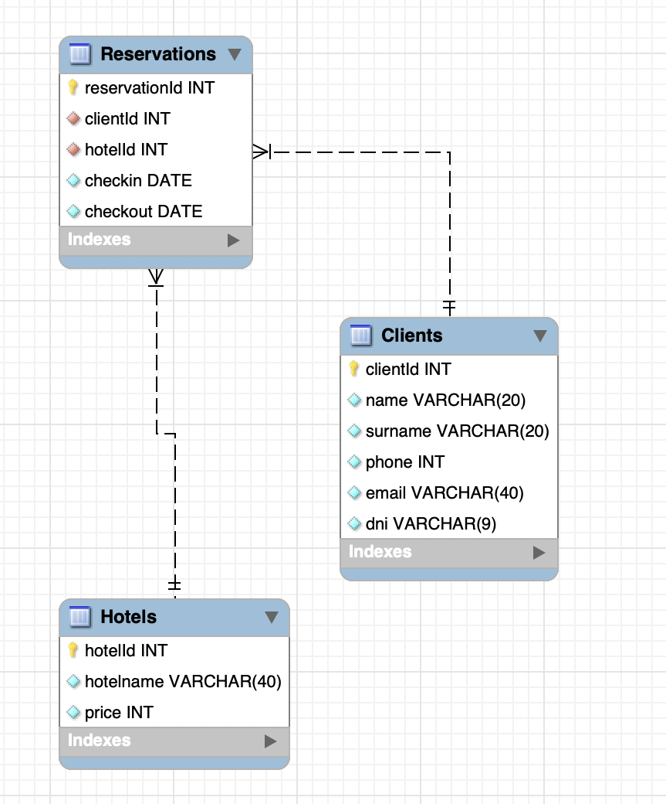

<p align="center">
  <a href="" rel="noopener">
 </a>
</p>

<h3 align="center">TRAVEL AGENCY DB</h3>

---

<p align="center"> Few lines describing your project.
    <br> 
</p>

## 📝 Table of Contents

- [About](#about)
- [Getting Started](#getting_started)
- [Deployment](#deployment)
- [Usage](#usage)

## 🧐 About <a name = "about"></a>

Travel agency database and API where you can store the data of the clients, the different hotels you manage and the reservations.

## DATABASE STRUCTURE



## 🏁 Getting Started <a name = "getting_started"></a>

To use this project you have two ways to use it:

Local:

- GIT PULL this project.
- Open it on any text editor of your choice, I recommend visual studio code.
- Run the command

```
npm install
```

to install all the node dependencies.

- Create an image of mysql using docker
- Run the server
- Import the `Hotels.sql` database to mySQLworkbench to generate the database.
- Run the command

```
npm run dev
```

to launch the server

- Open Postman or any other api interface to search the commands, with the url http://localhost:3000

Online:

- Use the url on your api interface: https://travelagencydb-production-7355.up.railway.app/

### Endpoints

Following endpoints to find all the data

## Users

- `/users` - clients listing
- `/users/:id` - search clients by id
- `/users/name/:name` - search clients by name
- `/users/dni/:dni` - search clients by dni
- `/users/email/:email` - search clients by email
- `/users/phone/:phone` - search clients by phone number

## Reservation

- `/reservation` - reservation listing
- `/reservaton/:id` - search reservations by id
- `/reservation/checkin/:checkin` - search reservations by checkin
- `/reservation/checkout/:checkout` - search reservations by checkout

## Hotels

- `/hotel` - get hotels listing
- `/hotel/:id` - get hotels by id
- `/hotel/name/:name` - get hotels by name

## ⛏️ Built Using <a name = "built_using"></a>

- [Javascript](https://www.mongodb.com/) - functionality
- [Express](https://expressjs.com/) - Server Framework
- [NodeJs](https://nodejs.org/en/) - Server Environment

## ✍️ Authors <a name = "authors"></a>

- [@shuii18](https://github.com/shuii18) - Idea & Initial work
